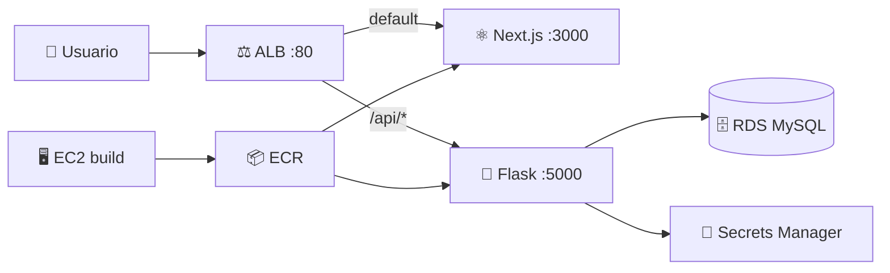

<div align="center">

# ☕ Ritual Roast

**Recetas de café en la nube** — Next.js + Flask + MySQL sobre AWS

<br/>


<br/>

[🏗️ Arquitectura](#-arquitectura-en-aws) ·
[📁 Estructura](#-estructura-del-repositorio) ·
[🚀 Despliegue](#-despliegue-resumen) ·
[📖 Infra Terraform](terraform/aws/README.md)

</div>

---

Aplicación web para gestionar recetas de café: un frontend en **Next.js** y un API en **Flask** que persiste datos en **MySQL**. La infraestructura vive en AWS y se despliega con **Terraform** (proyecto del curso *AWS Solutions Architect Associate*, sección de microservicios).

Este repositorio junta el código de las apps y la definición de la nube en un solo lugar.

---

## 📁 Estructura del repositorio

```
Ritual-Roast-V2/
├── 📊 Diagram/
│   ├── Arquitectura-microservicios-SSA.drawio
│   └── Arquitectura-microservicios-SSA.png
├── ⚛️ ritual-roast-nextjs-frontend/     → puerto 3000
├── 🐍 ritual-roast-flask-backend/       → puerto 5000
└── ☁️ terraform/aws/                    → infra AWS
```

| | Carpeta | Qué hace |
|---|---------|----------|
| ⚛️ | `ritual-roast-nextjs-frontend` | UI React/Next.js; llama al API con `/api/...` |
| 🐍 | `ritual-roast-flask-backend` | REST + MySQL; credenciales en **Secrets Manager** |
| ☁️ | `terraform/aws` | VPC, ALB, ECS Fargate, ECR, RDS, EC2 build, IAM |
| 📊 | `Diagram/` | Diagrama de arquitectura (draw.io + PNG) |

---

## 🏗️ Arquitectura en AWS

El diagrama resume cómo entra el tráfico, dónde corren los contenedores y cómo se protege la base de datos.


> 💡 Si solo ves el `.drawio`, ábrelo en [diagrams.net](https://app.diagrams.net) y exporta **PNG** como `Diagram/Arquitectura-microservicios-SSA.png`.

### 🔍 Lectura del diagrama (de fuera hacia dentro)

| | Capa | Qué representa |
|---|------|----------------|
| 🌐 | **Internet y DMZ** | Usuarios → **ALB** en subnets públicas. SG: **80/443** desde `0.0.0.0/0` |
| 🖥️ | **Web / App** | **Next.js TG** `:3000` (default) · **Flask TG** `:5000` (`/api/*`) · **ECS Fargate** + **ECR** |
| 🗄️ | **Datos** | **RDS MySQL** en subnets data · SG: **3306** solo desde app web |
| 🔐 | **Secretos** | **Secrets Manager** + **Lambda** de rotación · Flask/ECS leen credenciales |
| 🏭 | **Build (EC2)** | Descarga ZIPs, `docker build/push` → **ECR** (no recibe tráfico del ALB) |
| 🔀 | **VPC** | IGW + NAT + AZ **2a/2b** · En Terraform: CIDR `10.0.0.0/16` (`dev`) |



---

## 🔗 Cómo se hablan frontend y backend

El navegador abre la URL del ALB (`http://<alb_dns_name>`). Next.js hace `fetch("/api/get_recipe")`; el **mismo host** y el ALB envían `/api/*` a **Flask**. En producción no hace falta otro dominio para el API.

| Entorno | Quién enruta |
|---------|----------------|
| 🏠 Local | Cada app en su puerto |
| ☁️ AWS | **ALB** (regla de path) |

---

## 📱 Aplicaciones

### ⚛️ Frontend — `ritual-roast-nextjs-frontend`

| | Detalle |
|---|---------|
| 🧩 | Next.js, React, Tailwind |
| 🔌 | Puerto **3000** |
| 🐳 | `Dockerfile` en la raíz |

### 🐍 Backend — `ritual-roast-flask-backend`

| | Detalle |
|---|---------|
| 🧩 | Flask, `mysql-connector`, boto3 |
| 🔌 | Puerto **5000** |
| ❤️ | Health check ALB: `/api/health` |
| 🔧 | User-data parchea región y `SecretId` en `app.py` antes del build |

---

## 🚀 Despliegue (resumen)

📖 Guía completa → **[terraform/aws/README.md](terraform/aws/README.md)**

```powershell
cd terraform/aws
terraform init
terraform plan
terraform apply
```

| Paso | Qué pasa |
|------|----------|
| 1️⃣ | **EC2** construye y sube imágenes a **ECR** (~20–40 min la primera vez) |
| 2️⃣ | **ECS Fargate** registra tareas en los target groups |
| 3️⃣ | Abres **`alb_dns_name`** en el navegador |

---

## 🧭 Recursos útiles tras el deploy

| | Necesitas | Dónde |
|---|-----------|--------|
| 🌍 | URL pública | Output `alb_dns_name` |
| 📜 | Log bootstrap EC2 | SSM → `sudo tail -f /var/log/user-data-docker.log` |
| 📦 | Imágenes Docker | Consola **ECR** · outputs `ecr_*_repository_url` |
| 🎯 | Servicios | Consola **ECS** → cluster `ritual-roast-dev` |

---

## 📚 Licencia y contexto

Proyecto educativo basado en **IaaS Academy** (ZIPs y arquitectura de referencia).

Ajustes propios: Terraform modular, ECS Fargate, ECR, EC2 user-data, regla ALB `/api/*`, y fixes operativos (bash, IPv4, AL2023).

---

<div align="center">

**☕ Ritual Roast** — *Infra como código, café como servicio*

</div>
