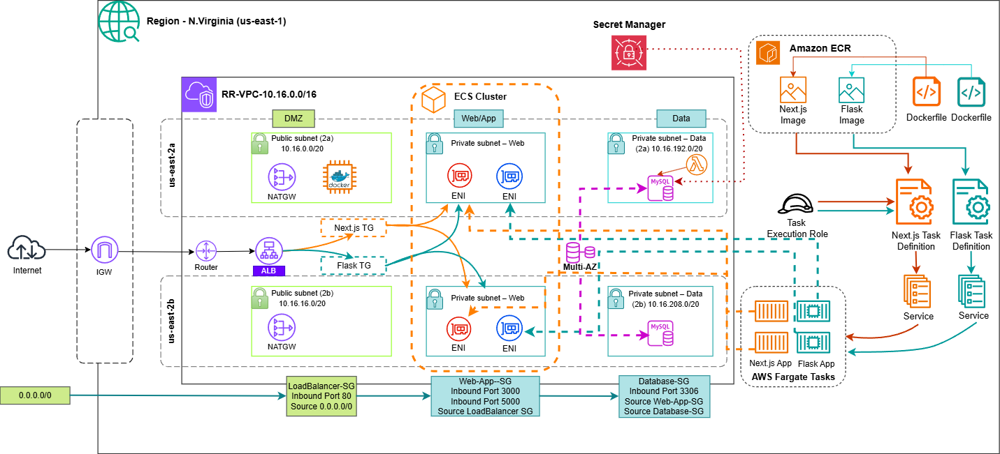
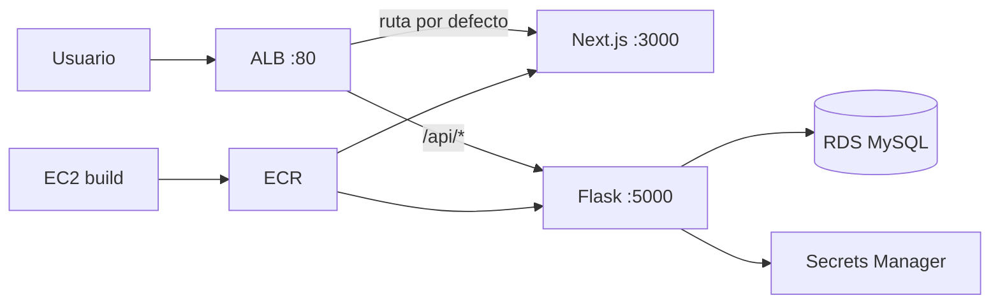

<div align="center">

# ☕ Ritual Roast

**Gestión de recetas de café** — aplicación web con arquitectura de microservicios en AWS

<br/>


</div>

---

## Tabla de contenidos

1. [Descripción](#descripción)
2. [Características](#características)
3. [Arquitectura](#arquitectura)
4. [Stack tecnológico](#stack-tecnológico)
5. [Estructura del repositorio](#estructura-del-repositorio)
6. [Desarrollo local](#desarrollo-local)
7. [Despliegue en AWS](#despliegue-en-aws)
8. [Después del despliegue](#después-del-despliegue)
9. [Documentación de infraestructura](#documentación-de-infraestructura)

---

## Descripción

**Ritual Roast** es una aplicación para consultar y administrar recetas de café. El frontend (Next.js) consume un API REST (Flask) que persiste la información en **MySQL**. Toda la plataforma en la nube está definida como código con **Terraform**: red, balanceo, contenedores, base de datos y pipeline de imágenes Docker.

Este monorepo incluye el código de las aplicaciones, el diagrama de arquitectura y los módulos de infraestructura.

---

## Características

| Área | Detalle |
|------|---------|
| **Frontend** | Next.js, React y Tailwind en el puerto **3000** |
| **Backend** | Flask en el puerto **5000**, credenciales vía **AWS Secrets Manager** |
| **Tráfico** | **ALB** enruta la web y las rutas `/api/*` al API sin dominio aparte |
| **Compute** | **ECS Fargate** (dos servicios, escalado por tareas) |
| **Imágenes** | **ECR**; build inicial desde EC2 con user-data |
| **Datos** | **RDS MySQL** en subnets privadas, sin acceso público |
| **Seguridad** | Security groups por capa; rotación de secretos con Lambda (opcional) |

---

## Arquitectura

### Diagrama



> El archivo editable está en `Diagram/Arquitectura-microservicios-SSA.drawio` ([diagrams.net](https://app.diagrams.net)). Para actualizar la imagen del README, exporta un PNG con el mismo nombre en `Diagram/`.

### Capas (de internet hacia la base de datos)

| Capa | Componentes | Rol |
|------|-------------|-----|
| **Pública (DMZ)** | Internet Gateway, ALB | Entrada HTTP **:80** desde internet |
| **Aplicación (privada)** | ECS Fargate, target groups | Next.js **:3000** (default) y Flask **:5000** (`/api/*`) |
| **Datos (privada)** | RDS MySQL | Solo tráfico **3306** desde la capa de aplicación |
| **Plataforma** | ECR, Secrets Manager, Lambda | Imágenes, credenciales y rotación |
| **Build** | EC2 en subnet webapp | Construye y publica imágenes en ECR (no recibe tráfico de usuarios) |

### Flujo de una petición



El navegador usa una sola URL (`http://<alb_dns_name>`). Las llamadas `fetch("/api/...")` las resuelve el ALB hacia Flask gracias a la regla de path `/api/*`.

---

## Stack tecnológico

| Capa | Tecnologías |
|------|-------------|
| Cliente | Next.js 15, React, Tailwind CSS |
| API | Python, Flask, `mysql-connector`, boto3 |
| Datos | Amazon RDS (MySQL 8) |
| Contenedores | Docker, Amazon ECR, ECS Fargate |
| Red y entrada | VPC, subnets públicas/privadas, NAT, ALB |
| IaC | Terraform (AWS provider ~> 5.x) |
| Operaciones | SSM Session Manager, CloudWatch Logs |

---

## Estructura del repositorio

```
Ritual-Roast-V2/
├── Diagram/                          # Diagrama de arquitectura (draw.io + PNG)
├── ritual-roast-nextjs-frontend/     # Aplicación web (puerto 3000)
├── ritual-roast-flask-backend/       # API REST (puerto 5000)
└── terraform/aws/                    # Infraestructura AWS (Terraform)
```

| Directorio | Contenido |
|------------|-----------|
| `ritual-roast-nextjs-frontend/` | UI, componentes y cliente HTTP hacia `/api` |
| `ritual-roast-flask-backend/` | API, conexión a MySQL y lectura de secretos |
| `terraform/aws/` | Módulos VPC, ALB, ECS, ECR, RDS, EC2, IAM, etc. |
| `Diagram/` | Documentación visual de la arquitectura |

---

## Desarrollo local

### Frontend

```bash
cd ritual-roast-nextjs-frontend
npm install
npm run dev
```

Abre `http://localhost:3000`. En local el API suele estar en otro puerto o detrás de un proxy; en AWS el ALB unifica ambos.

### Backend

```bash
cd ritual-roast-flask-backend
python -m venv .venv
# Activar el entorno e instalar requirements.txt
pip install -r requirements.txt
```

Configura región y `SecretId` en `app.py` (o usa credenciales de desarrollo apuntando a tu MySQL). El contenedor en AWS recibe esos valores vía user-data al construir la imagen.

---

## Despliegue en AWS

La guía detallada (variables, módulos, troubleshooting) está en **[terraform/aws/README.md](terraform/aws/README.md)**.

### Requisitos

- Terraform >= 1.1
- Cuenta AWS con permisos para VPC, EC2, ECS, ECR, RDS, ALB, IAM y Secrets Manager
- AWS CLI configurado

### Comandos

```powershell
cd terraform/aws
cp terraform.tfvars.example terraform.tfvars   # Ajustar valores; no subir tfvars a git
terraform init
terraform plan
terraform apply
```

### Secuencia esperada

1. Terraform crea red, ALB, ECR, RDS, cluster ECS y la EC2 de build.
2. La EC2 ejecuta user-data: descarga fuentes, `docker build` y `docker push` a ECR (la primera vez puede tardar **20–40 minutos**).
3. Los servicios ECS arrancan tareas Fargate y se registran en los target groups.
4. Accedes a la app con el output **`alb_dns_name`**.

---

## Después del despliegue

| Objetivo | Dónde / cómo |
|----------|----------------|
| URL de la aplicación | Output `alb_dns_name` |
| Estado del bootstrap EC2 | SSM → `sudo tail -f /var/log/user-data-docker.log` |
| Imágenes en ECR | Consola ECR o outputs `ecr_*_repository_url` |
| Servicios y tareas | Consola ECS → cluster `ritual-roast-dev` (nombre por defecto) |
| Salud del balanceador | Target groups del ALB → estado **healthy** |

---

## Documentación de infraestructura

- **[terraform/aws/README.md](terraform/aws/README.md)** — módulos, variables, flujo del ALB, EC2, ECS, RDS y resolución de problemas.
- **[Diagram/README.md](Diagram/README.md)** — archivos del diagrama.

---

<div align="center">

**Ritual Roast** — microservicios, infraestructura como código

</div>
